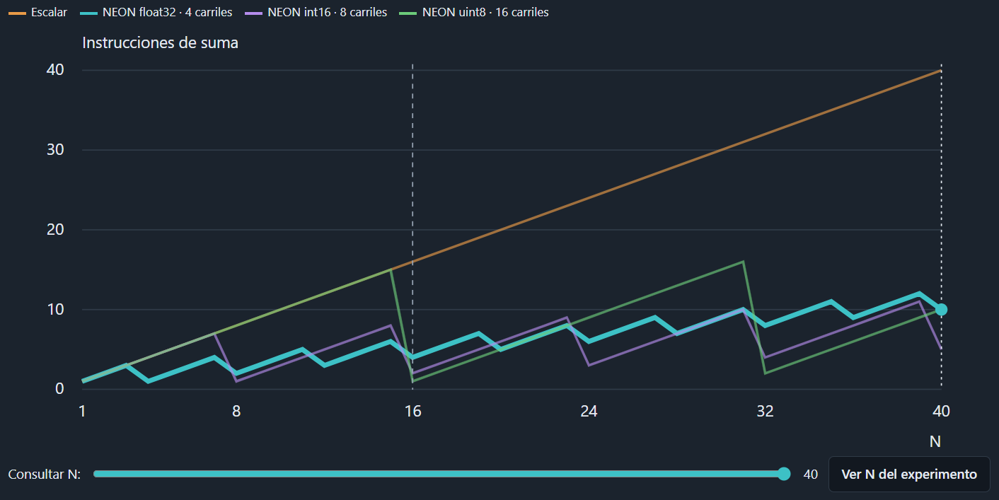

# Simulador escalar vs. NEON mejorado

Abre **index.html** con doble clic en Chrome, Edge o Firefox. Conserva todos los archivos de esta carpeta juntos. No necesita servidor, Internet ni instalar dependencias. El HTML original del profesor permanece en la carpeta superior.

## Uso

1. Elige `float32`, `int16` o `uint8`. Cambiar el tipo o la longitud genera un nuevo experimento.
2. Escribe A y B y pulsa **Aplicar datos**, o selecciona un ejemplo y pulsa **Cargar ejemplo**. Los ejemplos corresponden al tipo seleccionado.
3. Usa **Un paso**, **Siguiente** o **Reproducir / Pausar**. Cada paso muestra entrada a registros, suma y salida a C en paralelo para ambas rutas. El resultado se confirma al entrar a la fase de salida.
4. **Reiniciar ejecución** conserva los datos aplicados; **Generar datos** crea números nuevos. Los cambios de texto solo se aplican con el botón Aplicar datos.
5. Los botones superiores **Un paso** y **Reproducir** desplazan la página a la zona de ejecución, donde una barra permanece visible con controles locales sincronizados con los superiores. Los botones locales conservan tu posición de lectura.
6. **Anterior** retrocede; el deslizador **Paso k de N** permite ir directamente a cualquier paso, incluido el estado inicial. Ambas acciones pausan y restauran resultados, registros, conteos, columnas y traza. Reproducir continúa desde la posición elegida.
7. La gráfica compara instrucciones de suma para N de 1 a 40: escalar y NEON para los tres tipos. La curva del tipo actual está destacada. Consulta con ratón, toque, flechas, Inicio/Fin o el deslizador; consultar no modifica el experimento. La tabla desplegable contiene todos los valores.

Introduce entre 1 y 40 números en cada arreglo, con longitudes iguales. Separa los números con comas, espacios o saltos de línea; usa punto decimal. `uint8` admite enteros de 0 a 255; `int16`, de −32768 a 32767. `float32` admite entradas finitas que sigan siendo finitas al convertirlas a esa precisión; valores muy pequeños pueden redondearse a cero. Los errores se muestran junto al campo y no aplican los datos. Si el experimento estaba reproduciéndose, continuará con sus datos anteriores.

## Cómo leer la gráfica y la tabla de instrucciones



- **Eje X (horizontal): N**, cantidad de elementos de cada arreglo A y B. N=40 significa que se calculan 40 resultados en C.
- **Eje Y (vertical): instrucciones de suma**, cantidad de sumas escalares y/o vectoriales necesarias para calcular esos N resultados.

La gráfica muestra cuántas **instrucciones de suma** necesita cada ruta para calcular `C[i] = A[i] + B[i]`. El eje horizontal es **N**, la cantidad de elementos de cada arreglo. El eje vertical es el total de instrucciones de suma necesarias para terminar, no el progreso de una ejecución. Una curva más baja significa menos instrucciones de suma. La tabla desplegable presenta los mismos conteos, con una fila por cada N.

| Color / columna | Ruta | Elementos procesados por suma |
| --- | --- | --- |
| Naranja / Escalar | Un elemento a la vez | 1 |
| Turquesa / float32 | NEON, elementos de 32 bits | 4 |
| Morado / int16 | NEON, elementos de 16 bits | 8 |
| Verde / uint8 | NEON, elementos de 8 bits | 16 |

Un registro Q tiene 128 bits: caben `128 / 32 = 4` valores float32, `128 / 16 = 8` valores int16 o `128 / 8 = 16` valores uint8. Cada instrucción vectorial suma un grupo completo de elementos de A y B. En este simulador, los elementos que sobran se suman individualmente.

Para una ruta con **L carriles**, los conteos son:

```text
Escalar:             N
Grupos completos:    floor(N / L)
Residuo:             N % L
Total de ruta NEON:  floor(N / L) + N % L
```

`floor` toma la parte entera de la división y `%` obtiene el residuo. Por ejemplo, con N=17 y L=4 hay 4 grupos completos y 1 elemento sobrante: la ruta NEON necesita **4 sumas vectoriales + 1 escalar = 5 instrucciones**, frente a las 17 de la ruta escalar.

### Por qué las curvas NEON tienen dientes

Entre dos grupos completos, cada nuevo elemento agrega una suma escalar de residuo. Al completar el siguiente grupo, esos elementos pasan a resolverse juntos con una instrucción vectorial, por eso el conteo baja. En float32, N=7 requiere 1 suma vectorial y 3 escalares, un total de 4; N=8 requiere solo 2 sumas vectoriales. Se calculan más resultados con menos instrucciones de suma. Las caídas se repiten en múltiplos de 4, 8 y 16 según el tipo.

Si N es menor que L, no hay ningún grupo completo: toda la ruta NEON usa sumas escalares y coincide con la línea escalar. Tener más carriles no garantiza el menor conteo para cualquier N; también importa cuánto residuo queda. Por ejemplo, con N=40, uint8 necesita más sumas que int16 porque le sobran 8 elementos.

### Ejemplo de la captura: consulta N=40

| Ruta | Grupos completos | Sumas escalares de residuo | Total de sumas | Relación escalar / ruta |
| --- | ---: | ---: | ---: | ---: |
| Escalar | No aplica | No aplica | 40 | 1× |
| NEON float32, L=4 | 10 | 0 | 10 | 4× |
| NEON int16, L=8 | 5 | 0 | 5 | 8× |
| NEON uint8, L=16 | 2 | 8 | 10 | 4× |

En la captura, la curva turquesa más gruesa indica que el tipo del experimento es **float32**. La línea discontinua en **N=16** marca la longitud del experimento actual. La línea de puntos en **N=40** y el punto turquesa en **10 instrucciones** corresponden a la consulta de la gráfica. Consultar 40 no cambia la longitud del experimento; **Ver N del experimento** devuelve la consulta a 16.

La relación `40 / 10 = 4×` expresa una reducción de cuatro veces en el número de instrucciones de suma. **No significa que el programa tarde cuatro veces menos**: aquí no se cuentan cargas, almacenamientos, control del bucle, ciclos ni latencias. Las curvas comparan tipos de dato distintos; cambiar de float32 a uint8 también cambia la precisión, el rango y la representación de los valores.

## Comportamiento interactivo

- Animación didáctica en tres fases. Lenta, normal y rápida duran 1400, 800 y 300 ms por paso; cambiar velocidad afecta el siguiente paso. La preferencia de movimiento reducido evita animaciones y mantiene el intervalo de reproducción.
- Pausar o navegar cancela la animación pendiente y restaura el último paso confirmado. Un paso iniciado todavía en entrada o suma no cuenta como completado. Reiniciar, cambiar tipo/longitud, aplicar datos válidos o cargar un ejemplo cancela la ejecución anterior.
- El residuo se muestra como suma escalar; no ocupa carriles de los registros Q. Una ruta terminada queda en espera mientras la otra continúa.
- Los estados históricos preservan cero negativo e infinito sin convertirlos a JSON. Volver al final muestra la comprobación; retroceder oculta ese resultado hasta completar de nuevo.

`engine.js` valida entradas, ejecuta el cálculo y prepara estados históricos; `app.js` controla la pantalla y la reproducción; `comparison.js` dibuja la gráfica SVG y su tabla; `interactive.css` contiene los estilos de las mejoras. `tests.js` contiene los casos independientes. `control-tests.cjs` verifica los controles con un DOM mínimo y temporizadores simulados en Node, sin dependencias.

## Pruebas y resultados

Las 55 pruebas del motor se ejecutan desde la terminal e incluyen los 120 casos de tipo y longitud permitidos, las curvas de conteos y los estados históricos. Desde la carpeta superior, si tienes Node:

```sh
node simulador-mejorado/tests.js
node simulador-mejorado/control-tests.cjs
```

Se comprueban longitudes menores que un grupo, grupos completos y residuos para los tres tipos; correspondencia por índice; desbordamiento entero; redondeo float32; entradas inválidas; y conteos. Los resultados esperados son constantes declaradas en las pruebas: no se obtienen llamando a la función de suma que se está probando.

Ejemplos: `float32`, N=16, debe finalizar con 16 sumas escalares y 4 vectoriales. N=17 debe finalizar con 17 sumas escalares y una ruta NEON de 4 vectoriales + 1 escalar de residuo. Para reproducirlos manualmente, introduce 16 o 17 valores `2` en A y la misma cantidad de valores `3` en B: todos los resultados deben ser `5`.

Las 31 pruebas de controles verifican pausa, reinicio, datos manuales, ejemplos, temporizadores, estados finales, desplazamiento, retroceso, saltos, cancelación de callbacks antiguos en cada fase, sincronización de controles, consulta de gráfica y movimiento reducido. El DOM mínimo no verifica renderizado. Para revisión manual: abre index.html, carga un grupo con residuo, prueba cada control y consulta la gráfica; comprueba también una pantalla estrecha y la preferencia del sistema de reducir movimiento.

## Alcance del modelo

Se representa C[i] = A[i] + B[i]. Los registros de 128 bits contienen 4 elementos float32, 8 int16 o 16 uint8. Se forman grupos completos y el residuo se procesa escalarmente. Para N elementos y L carriles, la ruta NEON cuenta `floor(N/L)` sumas vectoriales y `N % L` sumas escalares de residuo.

Los enteros usan desbordamiento modular de 8 o 16 bits. Float32 redondea entradas y resultados con `Math.fround`; una suma de entradas finitas puede desbordar a infinito. No es una emulación completa de los modos especiales de punto flotante de ARM. El ADD escalar dibujado es ilustrativo y no incluye conversiones ni almacenamiento del resultado reducido a 8 o 16 bits.

La relación de instrucciones compara únicamente sumas: omite cargas, almacenamientos, control del bucle, pipeline y latencias. No mide ciclos, tiempos ni aceleración real. JavaScript no ejecuta instrucciones ARM/NEON. Las pruebas validan este modelo de software, no certifican equivalencia completa con un Allwinner A20 físico.

Referencias del proyecto: el simulador HTML original, la consigna en `Análisis_pcduino3.ipynb` y `A20-Brief-2013-02-27.pdf`, conservados en la carpeta superior. La validación realizada en esta versión corresponde al cálculo y a los controles de software.
